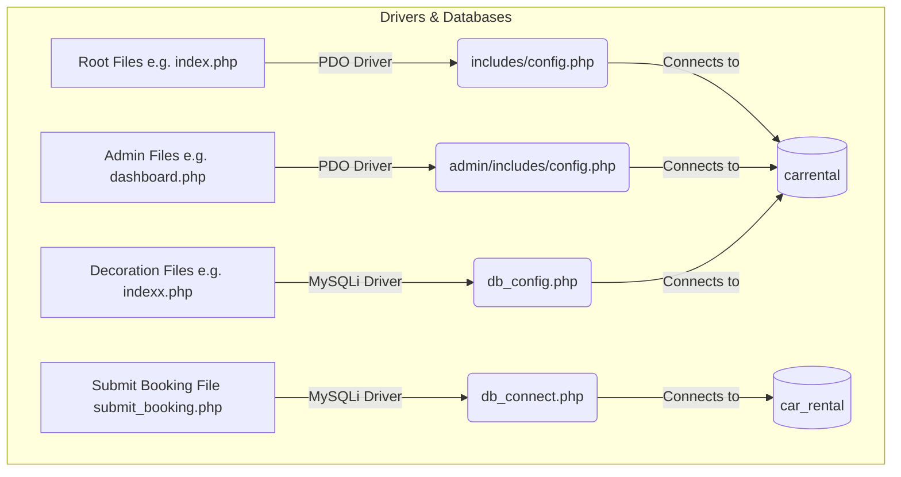

# 🚗 Car Hub - Premium Car Rental & Decoration Portal

Welcome to **Car Hub**, a modern, feature-rich **Car Rental & Custom Car Decoration Booking Portal** engineered with PHP, HTML5, CSS3, JavaScript, Bootstrap, and MySQL/MariaDB.

This developer-focused guide provides a complete architectural analysis of the project's folder structure, details the complex inclusion pathways, demystifies the confusing link structures, and provides copy-pasteable relative link fixes to make this application highly portable.

---

## 📁 Project Directory & Component Overview

Understanding the role of each directory is key to resolving inclusion and link path confusions. The directory is split into the **User Portal** (root) and the **Administrative Portal** (`/admin/`).

```text
carrental/
│
├── admin/                        # Administrative Control Panel (Backend)
│   ├── css/, js/, fonts/         # Admin dashboard theme assets
│   ├── img/                      # Admin-specific assets & uploaded vehicle images
│   │   ├── vehicleimages/        # standard portal vehicle images stored here
│   │   └── Car_Decor/            # Decoration vehicle images directory
│   ├── includes/                 # Admin-specific layouts & local DB connections
│   │   ├── header.php, sidebar.php, leftbar.php  # Admin navigation
│   │   └── config.php            # Admin PDO Database connection credentials
│   ├── decor_booking.php         # Admin panel to manage decoration bookings
│   └── index.php                 # Admin login page
│
├── assets/                       # Global frontend resources (Bootstrap, JS, Carousel, Fonts)
├── includes/                     # Frontend global includes (Common layouts, configurations)
│   ├── config.php                # Global PDO Database connection credentials
│   ├── header.php, footer.php    # Shared customer portal header & footer
│   ├── login.php, registration.php  # Modal authentication forms
│   └── sidebar.php, colorswitcher.php # Profile sidebar and color presets
│
├── db_config.php                 # Global MySQLi connection setting (pointing to 'carrental')
├── db_connect.php                # Local MySQLi connection setting (pointing to 'car_rental')
├── index.php                     # Customer home landing page
├── indexx.php                    # Management table page for decoration cars
├── process.php                   # Upload form for decoration cars
├── delete_vehicle.php            # Delete handler for decoration cars
├── car-listing.php               # Complete catalog of rent-ready vehicles
├── car_decor.php                 # Catalog of available wedding/decor vehicles
├── Decor_detail_view.php         # Detailed event booking configuration page
├── submit_booking.php            # Custom database insertion script for decor bookings
├── my-booking.php                # Standard vehicle booking history page
├── my-booking003.php             # Decoration vehicle booking confirmation page
├── kalol.php                     # Display page for custom decorative promo elements
├── contact-us.php                # General inquiry and message submission portal
└── carrental.7z                  # Compressed package containing 'assets/' and 'admin/' folders (due to large file size)
```

---

## 🔍 Confusing Links & Paths Demystified

During our system audit, we detected three major path and link confusions that can cause broken links, missing styling, unrendered images, or database errors. Below is their deep analysis and solution.

### 1. ⚠️ The Hardcoded Directory Bug (`/CRP/CRP/carrental/`)
Several files reference a deep hardcoded folder path (`/CRP/CRP/carrental/`) that was specific to the developer’s initial XAMPP setup. When the project is moved to another computer or deployed under standard paths (such as `http://localhost/carrental/`), these images, backgrounds, and links break completely!

#### 📍 List of Confusing / Hardcoded Links
| File Name | Line No. | Confusing/Broken Path | Problem Description |
| :--- | :--- | :--- | :--- |
| **`my-booking003.php`** | [Line 58](file:///c:/xampp/htdocs/CRP/CRP/carrental/my-booking003.php#L58) | `url('/CRP/CRP/carrental/admin/img/DEAL.jpg')` | Background image will not load unless the project resides in that exact double-nested path. |
| **`my-booking003.php`** | [Line 145](file:///c:/xampp/htdocs/CRP/CRP/carrental/my-booking003.php#L145) | `http://localhost/CRP/CRP/carrental/index.php` | The "HOME" redirect link is fully hardcoded to a local machine URL. |
| **`kalol.php`** | [Line 86](file:///c:/xampp/htdocs/CRP/CRP/carrental/kalol.php#L86) | `http://localhost/CRP/CRP/carrental/admin/img/kalolCon.png` | Fully absolute promo image path that fails immediately when deployed. |
| **`indexx.php`** | [Line 123](file:///c:/xampp/htdocs/CRP/CRP/carrental/indexx.php#L123) | `/CRP/CRP/carrental/admin/img/Car_Decor/{$row['vehicle_image']}` | Decoration listing thumbnail images are broken on standard setups. |
| **`contact-us.php`** | [Line 68](file:///c:/xampp/htdocs/CRP/CRP/carrental/contact-us.php#L68) | `url('/CRP/CRP/carrental/admin/img/kalol.jpg')` | Hardcoded absolute CSS background image path. |
| **`admin/includes/leftbar.php`** | [Line 25](file:///c:/xampp/htdocs/CRP/CRP/carrental/admin/includes/leftbar.php#L25) | `/CRP/CRP/carrental/process.php` | Admin sidebar links to the user-space file via a hardcoded absolute web path. |
| **`admin/includes/leftbar.php`** | [Line 26](file:///c:/xampp/htdocs/CRP/CRP/carrental/admin/includes/leftbar.php#L26) | `/CRP/CRP/carrental/indexx.php` | Sidebar links to decoration management using a hardcoded folder tree. |
| **`assets/css/style.css`** | [Line 1083](file:///c:/xampp/htdocs/CRP/CRP/carrental/assets/css/style.css#L1083) | `url("/CRP/CRP/carrental/assets/images/banner-image.jpg")` | Standard background hero banner will fail to display in CSS. |
| **`assets/css/style.css`** | [Line 2897](file:///c:/xampp/htdocs/CRP/CRP/carrental/assets/css/style.css#L2897) | `url("CRP/CRP/carrental/assets/images/contact-page-header-img.jpg")` | Contact us page banner image path is hardcoded. |

---

### 2. 🔌 The Dual Database Configuration Trap
The portal utilizes two separate PHP extension libraries to interact with MySQL: **PDO** (Object-Oriented/Prepared statements) and **MySQLi** (Procedural/Standard queries). 

Furthermore, files query two differently named databases: **`carrental`** and **`car_rental`**!



#### Detailed Breakdown of Configurations:
1. **`includes/config.php`** & **`admin/includes/config.php`** *(Standard Portal)*
   * **Connection Style**: PDO (Object-Oriented)
   * **Database**: `carrental`
   * **Used by**: Root files (`index.php`, `vehical-details.php`, `car-listing.php`, `profile.php`) and standard Admin files (`dashboard.php`, `manage-vehicles.php`).
2. **`db_config.php`** *(Decoration System)*
   * **Connection Style**: MySQLi (Procedural)
   * **Database**: `carrental`
   * **Used by**: `indexx.php`, `delete_vehicle.php`, and `admin/decor_booking.php`.
3. **`db_connect.php`** *(Decoration System Submissions)*
   * **Connection Style**: MySQLi (Procedural)
   * **Database**: `car_rental` *(Note the confusing underscore!)*
   * **Used by**: `submit_booking.php`.
4. **Hardcoded Inline Database Definitions**:
   * **`car_decor.php`** *(Lines 196-206)*: Standard PDO database credentials are hardcoded inline inside this file to connect to `car_rental`.
   * **`process.php`** *(Line 3)*: Directly calls `new mysqli("localhost", "root", "", "carrental")` rather than using `db_config.php`.
   * **`my-booking003.php`** *(Lines 5-10)*: Directly runs inline MySQLi connection variables to `carrental`.

> [!CAUTION]
> **Important Database Action Required**:
> Make sure to import the backup database with the name `carrental`. If any custom decoration page fails to retrieve listings or save bookings, inspect `db_connect.php` and `car_decor.php` and change the database name variable from `car_rental` to `carrental` so that all systems query the exact same unified database!

---

### 3. 🖼️ The Car Decoration Image Directory & Upload Mismatch
The files managing the custom **Car Decoration** system use mismatched directories when handling image files, leading to a broken upload pipeline:

* **Upload Target (`process.php`)**: When the user adds a new decorated vehicle, `process.php` designates `$target_dir = "uploads/";` in the root folder.
* **Missing Action (`process.php`)**: The file lacks the `move_uploaded_file()` operation. The record is entered into the database, but the image is never moved from the server's temp directory to the `uploads/` folder!
* **Delete Handler (`delete_vehicle.php`)**: Tries to search for and delete the image file inside the `"uploads/"` directory.
* **Display Catalog (`car_decor.php`)**: Tries to fetch and render the image from ``.
* **Management Table (`indexx.php`)**: Tries to display thumbnails from ``.

---

## 🛠️ Complete Side-by-Side Path Fixes

To resolve these confusing paths and make your project **100% portable** across any computer, open the affected files and replace the confusing paths with the robust relative paths below:

### 1. Hardcoded Links to Portable Relative Paths

#### File: `my-booking003.php`
* **Broken Line 58:**
  ```css
  background-image: url('/CRP/CRP/carrental/admin/img/DEAL.jpg');
  ```
* **Fixed Line 58 (Relative Path):**
  ```css
  background-image: url('admin/img/DEAL.jpg');
  ```
* **Broken Line 145:**
  ```html
  <a href="http://localhost/CRP/CRP/carrental/index.php" class="thank-you">HOME</a>
  ```
* **Fixed Line 145 (Relative Path):**
  ```html
  <a href="index.php" class="thank-you">HOME</a>
  ```

---

#### File: `kalol.php`
* **Broken Line 86:**
  ```html
  
  ```
* **Fixed Line 86 (Relative Path):**
  ```html
  
  ```

---

#### File: `indexx.php`
* **Broken Line 123:**
  ```php
  <td></td>
  ```
* **Fixed Line 123 (Relative Path):**
  ```php
  <td></td>
  ```

---

#### File: `contact-us.php`
* **Broken Line 68:**
  ```css
  background-image: url('/CRP/CRP/carrental/admin/img/kalol.jpg');
  ```
* **Fixed Line 68 (Relative Path):**
  ```css
  background-image: url('admin/img/kalol.jpg');
  ```

---

#### File: `admin/includes/leftbar.php`
* **Broken Lines 25-26:**
  ```html
  <li><a href="/CRP/CRP/carrental/process.php">Post Decor car</a></li>
  <li><a href="/CRP/CRP/carrental/indexx.php">Manage Decor car</a></li>
  ```
* **Fixed Lines 25-26 (Relative Path):**
  ```html
  <li><a href="../process.php">Post Decor car</a></li>
  <li><a href="../indexx.php">Manage Decor car</a></li>
  ```

---

#### File: `assets/css/style.css`
* **Broken Line 1083:**
  ```css
  background-image: url("/CRP/CRP/carrental/assets/images/banner-image.jpg");
  ```
* **Fixed Line 1083 (Relative Path):**
  ```css
  background-image: url("../images/banner-image.jpg");
  ```
* **Broken Line 2897:**
  ```css
  background-image: url("CRP/CRP/carrental/assets/images/contact-page-header-img.jpg");
  ```
* **Fixed Line 2897 (Relative Path):**
  ```css
  background-image: url("../images/contact-page-header-img.jpg");
  ```

---

## ⚙️ Setup & Installation Instructions (XAMPP Setup)

Follow these precise steps to get the portal up and running on your local machine:

### Step 1: Place the Project in XAMPP
1. Download or clone this repository.
2. Copy the `carrental` project directory.
3. Paste it inside `C:\xampp\htdocs\`.
4. Ensure the path is exactly: `C:\xampp\htdocs\carrental`

### Step 1.5: Extract Large Assets and Admin Folders (Crucial)
> [!IMPORTANT]
> **Extract `carrental.7z` before launching the website:**
> Due to high resolution images and assets, the **`admin/`** and **`assets/`** folders have been compressed into the **`carrental.7z`** archive to maintain a lightweight project size for staging.
> 1. Open the project root folder `C:\xampp\htdocs\carrental\`.
> 2. Locate the **`carrental.7z`** file.
> 3. Right-click and extract its contents directly into this folder using **7-Zip** or **WinRAR**.
> 4. Ensure that the extracted **`admin/`** and **`assets/`** folders are located directly in your root `carrental/` directory.
> 
> *Without this extraction, styling will be completely broken (CSS/JS files won't load), and the Administrative Control Panel will throw 404 Page Not Found errors!*

### Step 2: Start Services
1. Open the **XAMPP Control Panel**.
2. Click **Start** for both **Apache** and **MySQL**.

### Step 3: Set Up phpMyAdmin Database
1. Open [http://localhost/phpmyadmin/](http://localhost/phpmyadmin/).
2. Create a new database named **`carrental`**.
3. Create a secondary database named **`car_rental`** if you plan to keep separate configurations for custom bookings, or import the schema on both databases for compatibility.
4. Select your database, click **Import**, choose the `.sql` backup file, and run the import.

### Step 4: Verify Database Connection Files
Verify that the credentials in the following configuration files match your local database settings:
* **`includes/config.php`** (Primary PDO Connection)
* **`admin/includes/config.php`** (Admin PDO Connection)
* **`db_config.php`** (Decoration MySQLi Connection)
* **`db_connect.php`** (Decoration Submission MySQLi Connection)

---

## 🔑 Login & Test Credentials

Use these default credentials to test the various portals of the portal:

### 🛡️ Administrative Portal
*   **URL**: [http://localhost/carrental/admin/](http://localhost/carrental/admin/)
*   **Username**: `admin`
*   **Password**: `Test@12345`

### 👤 Customer Portal
*   **URL**: [http://localhost/carrental/](http://localhost/carrental/)
*   **Username / Email**: `test@gmail.com` | **Password**: `Test@123`
*   **Username / Email**: `amikt12@gmail.com` | **Password**: `Test@123`

---

## 📤 Guidelines to Upload to GitHub

Ready to push your project to a remote server or share it on GitHub? Follow these clean git commands:

1. Open your terminal or Git Bash inside the root folder: `C:\xampp\htdocs\carrental`
2. Initialize version control:
   ```bash
   git init
   ```
3. Add all files to the staging index:
   ```bash
   git add .
   ```
4. Record the changes to your repository:
   ```bash
   git commit -m "Initial commit: Car Hub Portal with detailed path and database configuration updates"
   ```
5. Create a new repository on [GitHub](https://github.com/) (e.g., `car-hub-portal`).
6. Map the local repository to the remote origin:
   ```bash
   git remote add origin https://github.com/your-username/car-hub-portal.git
   git branch -M main
   ```
7. Push files to the main branch:
   ```bash
   git push -u origin main
   ```

---
*Made with ❤️ for high-performance responsive web design and seamless database architectures.*
